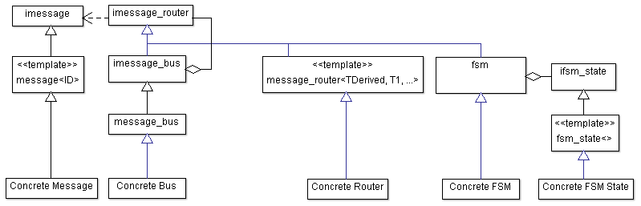

## Headers

- `message.h`  
  Defines the core message model. etl::imessage is the base interface (virtual or non-virtual, depending on `ETL_HAS_VIRTUAL_MESSAGES`). `etl::message<ID>` provides typed messages with static IDs. Type traits (`is_message`, `is_message_type`, etc.) and ID comparison utilities support compile-time validation.  
- `message_router.h`  
  Defines `etl::imessage_router`, the central routing interface with receive, accepts, and router identity. Provides message_router<TDerived, ...> that statically dispatches by message ID (contiguous IDs optimized). Includes null_message_router and message_producer helpers, plus send_message utilities.  
- `message_bus.h`  
Implements `etl::imessage_bus`, a router that manages a sorted list of subscribed routers and forwards messages based on destination ID (broadcast or addressed). Supports subscription limits and forwards to successors.  
- `message_broker.h`  
  Implements etl::message_broker, a router with explicit subscription objects mapping routers to message ID lists (span). It routes only to subscribers that match both message ID and destination ID, then forwards to any successor.
- `message_packet.h`  
  A type-erased, in-place container for a fixed set of message types. Validates message ID acceptance, supports copy/move, and exposes `get()` as `etl::imessage&`. Uses aligned storage sized to the largest message type.  
- `shared_message.h`  
  Reference-counted wrapper around pooled messages (`ireference_counted_message_pool`). Supports copy/move semantics with automatic release when the last reference drops.

## Basic architecture

