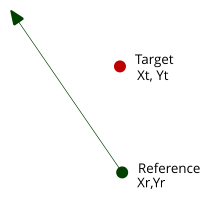
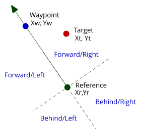
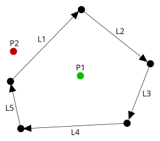

**Author:** John Wellbelove  
**Date:** 2019  

## The problem
Sometimes in graphical applications there is a need to know the relative position of a point with respect to a line from a reference point.  

Where is the target in relation to the reference and its direction?  
Dot and cross products can make this an easy task.  

Let's start with a reminder of what dot and cross products are.  

Take two vectors `x1,y1` and `x2,y2`  
The dot product is `(x1 * x2) + (y1 * y2)` and the cross product is `(x1 * y2) - (x2 * y1)`.  

Remember that the dot product is a scalar based on `cos(θ)` and the cross product is a scalar based on `sin(θ)`.  

**Example**  

We have a reference object at `Xr,Yr` facing in the direction of the arrow.  

The target is at point `Xt,Yt`  

A arbitrary point on the line from the reference in the specified direction is `Xw,Yw`  

First, find the coordinates of the target and waypoint relative to the reference.  

`dXw = Xw - Xr`  
`dYw = Yw - Yr`  
`dXt = Xt - Xr`  
`dYt = Yt - Yr`  

Now find the dot and cross products of these vectors.  

`Dot   = (dXw * dXt) + (dYw * dYt)`  
`Cross = (dXw * dYt) - (dXt * dYw)`  

The absolute values of the dot and cross products is unimportant, we just need the *sign*.  

`Dot > 0`, `Cross < 0` : The target is forward of the reference and to the right.  
`Dot > 0`, `Cross > 0` : The target is forward of the reference and to the left.  
`Dot < 0`, `Cross < 0` : The target is behind the reference and to the right.  
`Dot < 0`, `Cross > 0` : The target is behind the reference and to the left.  

*forward*, *behind*, *left*, and *right* are relative to the reference's direction.  
This calculation will be valid for any direction.

## Other uses
This technique can also be used to determine if a point is within a closed convex hull.  

A closed convex hull defined by the lines `L1`, `L2`, `L3`, `L4`, and `L5`.  
Point `P1` is inside the hull, point `P2` is outside.  
For `P1`, the cross product for all of the lines will indicate that it is to the *right* and therefore, *must* be inside.  
For `P2`, the cross product for `L1` will put it on the *left* hand side and therefore it *cannot* be inside the hull.  

**Why does this work?**  
The dot product of vectors `A` and `B` is `|A||B|cos(Ø)`  
The cross product of vectors `A` and `B` is `|A||B|sin(Ø)`  
Where `Ø` is the angle between the vectors `A` and `B`. Range `+-180°`

Therefore the sign of the result indicates the quadrant that target occupies in the circle around the reference, relative to the reference's direction.  
