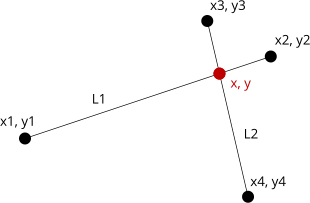
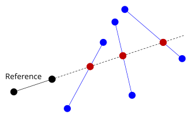
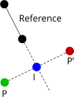

**Author:** John Wellbelove  
**Date:** 2019  

It's quite common in graphics and image processing to want to know the intersection coordinates of two lines.  

The common formula for a line is the familiar `y = Mx + C`.  

But there is another that can be a lot easier to use when determining line to line intersections in a graphical environment.

## The issues

When using `y = Mx + C` you must be aware of the situations of when the line approaches 'vertical'.  
In this case `M` tends towards infinity, which is not good in a programming environment.  

The usual trick is to flip the coordinates when the slope is more than 1, and then flip back after the calculations have been made.
This can be confusing to follow and result in errors.

Also, to keep any accuracy, the calculations must normally be kept in the floating point domain, which is not ideal for performance, as the image will be in integral pixel coordinates.

## The solution

Change the definition of your lines to use the formula `Ax + By = C`.

Ideally, your lines would already be in the form `Ax + By = C`, but this is not normally the case, but we *can* easily generate the parameters from two points.  
Assume we have a line defined by `(x1, y1)` and `(x2, y2)`.  

We can deduce `A`, `B`, and `C` thus:

`A = y2 - y1`  
`B = x1 - x2`  
`C = Ax1`+ `By1`  

---

Another useful calculation is the *determinant*.  
Given two lines `A1x + B1y = C1` and `A2x + B2y = C2`:  

`determinant = A1 * B2 - A2 * B1`

If `determinant` is zero, then the lines are parallel.  

### Notes

- If `A` and `B` are both non-zero.  
  The equation represents a diagonal line.

- If `A == 0`, `B != 0`.  
  The line is the parallel to the x-axis.

- If `A != 0`, `B == 0`.  
  The line is the parallel to the y-axis.

- If `C == 0`
  The line passes through the origin.

## Calculating the intersection

The intersection point is calculated like this:  

Given two lines described by the points `(x1, y1)`, `(x2, y2)`, and `(x3, y3)`, `(x4, y4)`.  

- Calculate the parameters `A`, `B`, and `C` for each.  
  `A1x + B1y = C1` and `A2x + B2y = C2`  

- Calculate the determinant.  
  `determinant = A1 * B2 - A2 * B1`

- If `determinant == 0` then the lines are parallel, and there is no intersection point.

- Otherwise  
  `x = (B2 * C1 - B1 * C2) / determinant`  
  `y = (A1 * C2 - A2 * C1) / determinant`  

## They don't need to physically intersect

The intersection point can be found even if the line segments aren't actually long enough to intersect.  
The calculation will effectively extend them to where they *would* intersect, if long enough.  

This means you can find intersection points relative to a fixed reference line.

## Refection

This describes reflecting a point across a reference line.  
It uses the intersection method described above.

In the example below, we want to reflect `P` in the line `Reference`, to give us `P'`.  

First, we need the reference line in the form `Ax + By = C`.  

Next, we need to find the perpendicular from `Reference` through `P`.  
Any line perpendicular to `Ax + By = C` takes the form `−Bx + Ay = D`.  
To find `D`, just substitute the `x,y` coordinates from `P`.  

Now we have the two lines in the form we require to find the intersection.

Find `I`, which is the intersection of the reference line and the perpendicular to `P`.

Compute `P'` by using the formula `P' = I + (I - P)`.  
This calculates the vector from `P` to `I` and then adds it to `I` to move the same amount again.

## Line to point distance

The above technique can be used to find the distance of a point to a reference line.  
This distance is merely the absolute length of the vector `I - P`.
