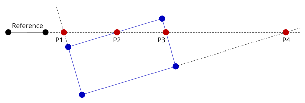
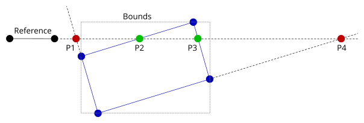
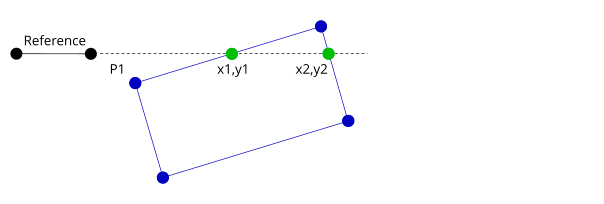
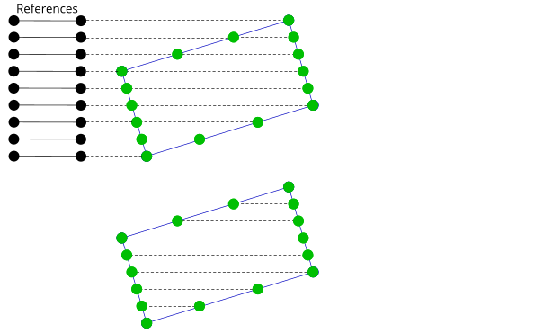

**Author:** John Wellbelove  
**Date:** 2019  

Quite often in image processing we need to scan a rectangular region in an image. The region is usually aligned to capture a specific feature in the image.  
You may be presented with a skewed image, necessitating that the region should also be skewed.  

If it is not absolutely necessary to scan the region at the angle of skew, then the fastest way to interrogate the pixels is to scan the image horizontally.  

As was shown in the previous post, the crossing points between two lines can be easily and efficiently determined.  
By moving a reference line down across the region, the start and end x coordinates of each scan line can be found.  
Only the y coordinate of the reference line is relevant, though it must have a length of at least 1 unit.  

Of course, we must check every line in the rectangle, and every line in the rectangle may produce a crossing point.  
The reference line shown below will identify points `P1`, `P2`, `P3` and `P4` as valid crossing points.  

The solution is to compare the crossing coordinates against the bounds of the enclosing rectangle. 

This would eliminate points `P1` and `P4`. 

This can be done for all scan lines in the bounded rectangle.

Vertical scans may be easily achieved by simply having a vertical reference line.  
This technique can be applied to any convex hull.

